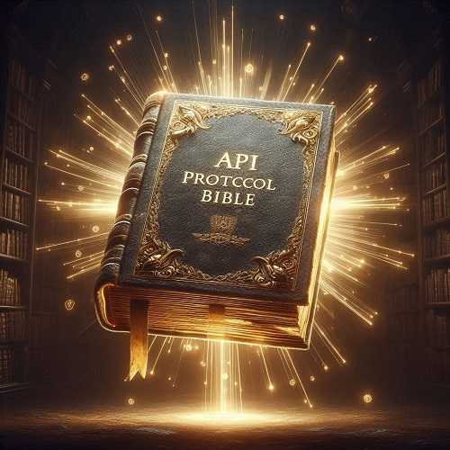

# API Protocols Bible

This repository contains detailed information about various API protocols used for communication between systems. Each protocol offers unique solutions for different communication and integration needs.

## Protocols Covered

1. [GraphQL](graphql.en.md)
2. Webhooks
3. REST
4. Server-Sent Events (SSE)
5. Electronic Data Interchange (EDI)
6. Event-Driven Architecture (EDA)
7. WebSockets
8. Simple Object Access Protocol (SOAP)
9. gRPC
10. Message Queuing Telemetry Transport (MQTT)
11. Advanced Message Queuing Protocol (AMQP)

## Available Languages

- [Português](README.md)

## Credits

Created by [Carlos Costa](https://www.linkedin.com/in/carlos-costa-0b548675/).
