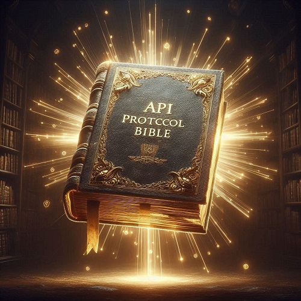

# Bíblia dos Protocolos API

Este repositório contém informações detalhadas sobre diversos protocolos API utilizados para comunicação entre sistemas. Cada protocolo oferece soluções únicas para diferentes necessidades de comunicação e integração.

## Protocolos Abordados

1. [GraphQL](graphql.md)
2. Webhooks
3. REST
4. Server-Sent Events (SSE)
5. Electronic Data Interchange (EDI)
6. Event-Driven Architecture (EDA)
7. WebSockets
8. Simple Object Access Protocol (SOAP)
9. gRPC
10. Message Queuing Telemetry Transport (MQTT)
11. Advanced Message Queuing Protocol (AMQP)

## Linguagens Disponíveis

- [English](README.en.md)

## Créditos

Este projeto foi criado por [Carlos Costa](https://www.linkedin.com/in/carlos-costa-0b548675/).
